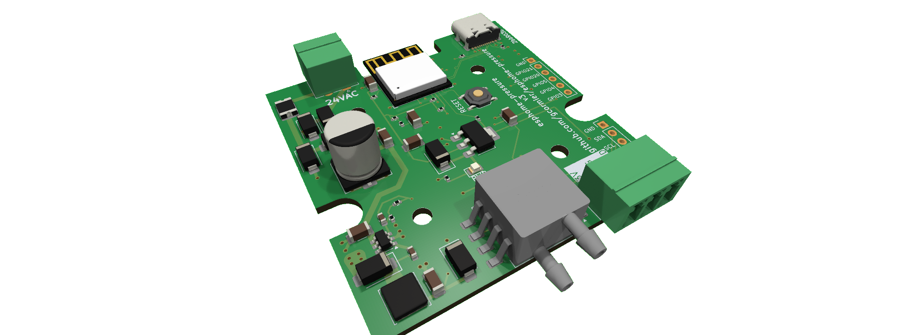

# esphome-pressure
<a href="https://www.tindie.com/products/gcormier/esphome-pressure/"></a>

This is a custom device for reading differential pressure. The most useful example I can think of is monitoring your pressure
drop across your air filter. This is a great way to know when to change your filter.

It is based on an ESP32-C3-MINI, which has native USB-C for flashing.

The pressure sensor part number will control the differential range that can be expected, as well as the accuracy (+/- 2%). I've chosen +/- 0.5kPa, which is about 2" of pressure drop. Most HVAC systems are designed to have a pressure drop of 0.1" (0.025kPa).


## Temperature Sensors
Version 3 (Dec 2024) is now available. It adds an additional pluggable header that will support Dallas 1-wire temperature sensors. The temperature sensor is optional, and the device will work without it. If you are using a Dallas DS18B20 sensor, I strongly recommend using Digikey, Mouser or Adafruit to avoid obtaining [counterfeit sensors](https://github.com/cpetrich/counterfeit_DS18B20/tree/master). Since these sensors use a 1-wire bus, and each have a unique ID, you can have as many sensors as you want using the single connection.

You will need to find out your sensor ID's as per the [esphome documentation](https://esphome.io/components/one_wire#one-wire).


## Damage
Sensor specifications:

- Up to 5X rated pressure is unlikely to cause issues
- Between 5X-10X rated pressure, the sensor might gain a permanent 'offset'
- Above 10X it is likely to burst and/or be permanently damaged

## Power Supply
- USB-C
- AC - 24VAC maximum. (common voltage used in HVAC system)
- DC - 9-30VDC. A 12V or 24V DC wall wart should be fine.

It has a 500mA polyfuse directly off the screw terminal inputs to protect your HVAC system. The USB-C port is unfused and should be protected by the upstream device.

## Flashing / Programming
The USB-C port can be used to program. The first time, the reset button must be held. After this, all subsequent programming does not require access to the button.

## Enclosure
The PCB will fit inside a [Hammond 1593KBK](https://www.hammfg.com/part/1593KBK) case. You can either cut (CNC) or 3D-print the faceplates. You can superglue some magnets in the case to have it stick to your HVAC system.

### Setup guide
1. While holding the button, plug in the USB-C cable to your computer. This will put the device into programming mode. Holding the button
is only required the first time you flash the firmware, or if you really mess something up. Future updates can be done over WiFi, or without
needing to push the button.
2. Flash esphome using the sample [esphome.yaml](esphome.yaml) file. You will need to change the wifi settings to match your network. You can use
a [secrets.yaml](https://esphome.io/guides/faq.html) file to keep your wifi password out of the main file, or you can keep it hardcoded into
the main file.
3. Power-cycle the device, and you should be able to see the device shortly in Home Assistant.
4. With both ports **unconnected**, make a note of the value of the sensor.
5. For example, if your sensor is reading -40Pa when the ports are disconnected, you can set the offset to 40 to zero out the sensor in the esphome.yaml file. eg.
```
sensor:
  - platform: xgzp68xx
    temperature:
        name: "Temperature"
    pressure:
        name: "Differential Pressure"
        filters:
            - offset: 40
```
6. Reprogram the device with the new offset. It should now report 0Pa when the ports are unconnected.
7. Using some tubing, connect the ports to the pressure points you wish to measure. For example, you can connect one port after the air filter, and the other to the return air duct. You can then monitor the pressure drop across the filter.

Note the sensor accuracy is +/- 2%. It is quite sensitive to pressure changes, so you may with to use other [esphome filters](https://esphome.io/components/sensor/index.html#sensor-filters) in order to smooth out the values.

## Hose/tubing
The following are based on feedback from users. If you would like to contribute something you've found to work well, please let me know via pull request, GitHub issue, or email.


| Size/Material | Sample Amazon Keywords | Comments |
|------|----------|----------|
|2.5mm ID, 4mm OD polyurethane|Pneumatic Tubing - Polyurethane Air Compressor Hose Pipe, Apply to Air Line Transfer (4mm OD 2.5mm ID)|Works well, a bit stiff|
|1/16" ID, 1/8" OD silicone|1/16" ID x 1/8" OD Pure Thin Silicone Tubing Food Grade Pure Silicon Tube High Temp Home Brewing Winemaking Silicone Hose Tubing, 26.25ft Length|Very tight fit, suggest other sizes|
|2mm ID, 4mm OD silicone|Pure Silicone Tubing, 2mm ID x 4mm OD High Temp Food Grade Tube Pure Silicone Hose Tube|Works well|
|3mm ID, 5mm OD silicone| | Too loose! Do not use|

## GPIO Breakout
There are now GPIO's broken out on a 2.54mm (0.1") header. The i2c bus is also broken out.
These are all 3.3V logic pins, be careful not to source too much current from the power pins.